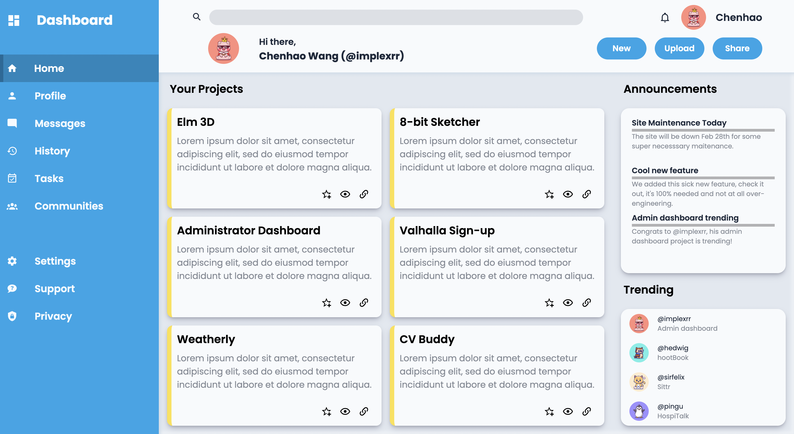

# Admin Dashboard

Admin Dashboard is the final project from the [Intermediate HTML and CSS](https://www.theodinproject.com/paths/full-stack-javascript/courses/intermediate-html-and-css) section of [The Odin Project](https://www.theodinproject.com/paths/foundations/courses/foundations). It is intended to give students an opportunity to combine intermediate CSS concepts such as custom properties, CSS units/functions and advanced selectors with CSS Grid. Working demo [here](https://implexrr.github.io/admin-dashboard/). As the project is meant to be just the UI portion of an admin dashboard, the project is written entirely in vanilla HTML/CSS.



## Installation

To create a copy of the project, type the following command into your terminal:

```bash
git clone git@github.com:implexrr/admin-dashboard.git
```

Note that the stylesheet and script link paths in this project will need to be changed in order for the CSS files to render properly.

## Usage/Features
[Take a look here!](https://implexrr.github.io/admin-dashboard/).
- Hamburger menu with selection animations
- Resizable dashboard with project cards
- Smooth hover animations for most site elements


## Things I learnt creating the project
  - Custom properties
  - Custom animations
  - CSS Grid
  - Dynamic element re-sizing
  - Modularization of CSS files
  - CSS variables


## Contributing

Pull requests are welcome. For major changes, please open an issue first
to discuss what you would like to change.

Please make sure to update tests as appropriate.

## License

[MIT](https://choosealicense.com/licenses/mit/)